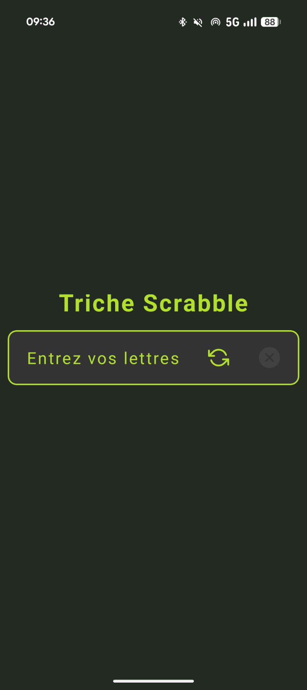
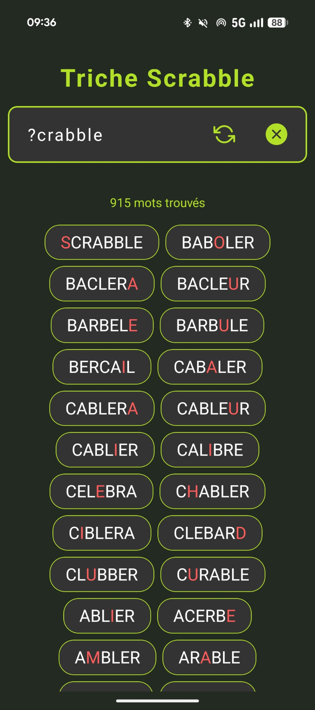

# 🆂tephagramme

## 📖 Description

Stephagramme est une application mobile Expo/React Native dédiée à la recherche d’anagrammes et à l’aide au Scrabble. Elle permet de trouver tous les mots possibles à partir d’un tirage de lettres, de gérer les jokers (`?`), de filtrer par longueur, et d’obtenir la définition des mots via le Wiktionnaire.

## 🚀 Fonctionnalités

- [x] Recherche d’anagrammes à partir d’un tirage de lettres
- [x] Gestion des jokers (`?`) pour remplacer n’importe quelle lettre
- [x] Affichage des définitions des mots via l’API Wiktionnaire
- [x] Affichage des résultats triés par longueur
- [x] Lien direct vers la page Wiktionnaire du mot

## 🛠️ Technologies utilisées

- **Front-end** : React Native, Expo, TypeScript
- **Librairies** : expo-av (audio), expo-router, expo-audio (optionnel)
- **Base de données** : Dictionnaire ODS6 au format JSON
- **API externe** : Wiktionnaire (définitions)
- **Autres** : Git, EAS Build

## 📂 Structure du projet

```bash
Stephagramme/
│── app/                # Pages et composants Expo Router
│── assets/             # Images, dictionnaires JSON
│── utils/              # Fonctions utilitaires (anagrammes, définitions, etc.)
│── node_modules/       # Dépendances npm
│── package.json        # Dépendances et scripts
│── app.json            # Configuration Expo
│── eas.json            # Configuration EAS Build
│── README.md           # Documentation principale
```

---

## ⚙️ Installation & utilisation

### 1. Pré-requis

- Node.js >= 18
- npm >= 9
- Un émulateur Android/iOS ou Expo Go sur votre smartphone

### 2. Cloner le projet

```bash
https://github.com/MarineG404/Stephagramme/
```

### 3. Installer les dépendances

```bash
npm install
```

### 4. Lancer l’application

```bash
npx expo start
```

Suivez les instructions pour ouvrir l’app sur un émulateur ou Expo Go.

## 📸 Captures d’écran




## 👥 Auteurs / contributeurs

- Marine - Développement, conception, intégration
